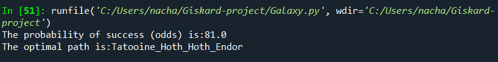
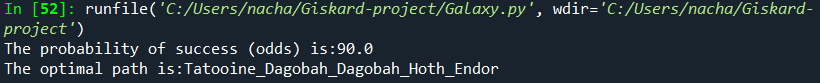
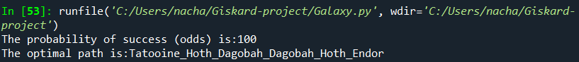
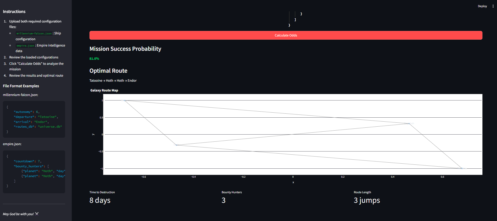

# Giskard technical test solution
Here is my solution to the odds technical test.

## Tools ##

### Front-end
The front-end is developed using HTML in index.html. It is created using jquery and ajax for minimal single-web-application creation
  
### Back-end
The back-end is developed using python. It contains:
  - The class Galaxy.py with two objects: Empire and Millennium Falcon, and all necessary methods:
      - read_ROUTES(): Read the SQLite database and return pandas dataframe, called _routes_.
      - create_Graph(): From the dataframe _routes_, return the associated _graph_ whose nodes are _origins_ and _destinations_ and the edges denote _travel time_.
      - find_feasible_paths(): Find all feasible paths from _Departure_ to _Arrival_ that satisfy the constraint of millennium falcon's autonomy
      - find_acceptable_paths(): Find all (direct) acceptable paths such that the Millennium falcon reaches Endor before countdown
      - find_alternative_paths(): Find all alternative paths when there is a delay (e.g. 1 day) between the expected arrival day and the countdown, where the millennium falcon can make a stop during this delay.
      - give_me_the_odds(): Compute the odds that the Millennium Falcon reaches Endor in time and saves the galaxy. _Bonus: this function returns also the optimal path corresponding the odds_
    Note that Galaxy's methods require three librairies: _pandas_, _networkx_ and _sqlite3_.
  - The executable give-me-the-odds.py, to be executed in the command-line interface (CLI).
  - The back-front connection webapp.py created using the library flask.
  
### Illustration on examples 1 to 4

For Example 1:


For Example 2:



For Example 3:



For Example 4:



## Guide to run the final application ##

### CLI
The command-line interface can be executed in shell, for example1, as follows:
```sh
  $ python give-me-the-odds.py example1/millennium-falcon.json example1/empire.json
```

### Web Application
In a command-line (e.g. Powershell), execute the following command:
```sh
  $ flask --app webapp run
```
to launch the page application (e.g. with the link http://127.0.0.1:5000), upload the empire.json file and click on get the odds to obtain the result.


