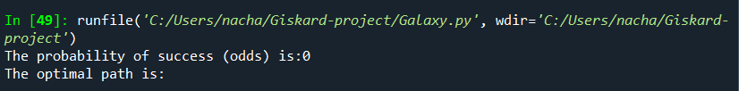
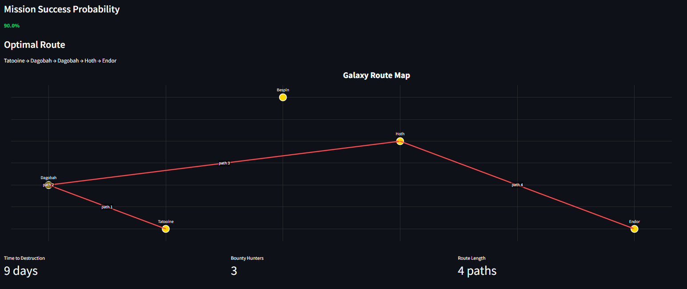

# Millennium Falcon Calculator 

> This repository contains my solution to the [Developer Technical Test](https://github.com/lioncowlionant/developer-test) by lioncowlionant.

[](https://www.python.org/downloads/)
[](https://flask.palletsprojects.com/)
[](https://jquery.com/)

A simple application to calculate the odds of the Millennium Falcon successfully reaching Endor and saving the galaxy. This solution implements both CLI and web interfaces for computing probabilities based on complex route calculations and Empire interceptor locations.

## 📋 Problem Statement

This project implements a solution for computing the probability of the Millennium Falcon reaching Endor before the Death Star destroys the planet. The calculation takes into account various factors including:

Route optimization with fuel constraints
Empire bounty hunter presence
Time-based countdown mechanics
Multiple possible paths and refueling strategies

- Route optimization with fuel constraints
- Empire bounty hunter presence
- Time-based countdown mechanics
- Multiple possible paths and refueling strategies

## 🛠️ Technical Stack


### Backend
- Python 3.8+ for core logic
- Streamlit for web server implementation
- SQLite for route database
- Key libraries:
  - `pandas` for data manipulation
  - `networkx` for graph calculations
  - `sqlite3` for database interactions

## 🏗️ Architecture

### Core Components

#### Galaxy Class
The heart of the application, implementing core game logic:

```python
class Galaxy:
    def __init__(self):
        self.empire = None
        self.millennium_falcon = None
```

Key Methods:
- `read_ROUTES()`: Database interaction for route retrieval
- `create_Graph()`: Graph construction from route data
- `find_feasible_paths()`: Path calculation within autonomy constraints
- `find_acceptable_paths()`: Direct path validation against countdown
- `find_alternative_paths()`: Alternative route calculation with delays
- `give_me_the_odds()`: Final probability computation with optimal path

## 🚀 Getting Started

### Prerequisites
- Python 3.8 or higher
- Streamlit framework
- Required Python packages:
  ```bash
  pip install pandas networkx streamlit
  ```

### Command Line Usage
```bash
python give-me-the-odds.py <millennium-falcon.json> <empire.json>
```

### Web Application Launch
```bash
streamlit run webapp.py
```
Access the application at `http://127.0.0.1:5000`

## 📊 Examples

### Example 1: Basic Route

Demonstrates basic path finding with minimal constraints.

### Example 2: Complex Routing

Shows multiple path options with interceptor consideration.

### Example 3: Delay Management

Illustrates route optimization with timing constraints.

### Example 4: Advanced Scenario

Demonstrates complex probability calculations with multiple variables.

## 🌐 Web Interface


The Streamlit-powered interface provides:
1. Interactive file upload and validation
2. Real-time route visualization with Plotly
3. Dynamic probability calculations
4. Mission metrics dashboard
5. Interactive path analysis
6. Responsive design for all devices

## 🤝 Contributing
Contributions are welcome! Please feel free to reach out with any suggestions or improvements.

## 📝 License
This project is licensed under the MIT License - see the LICENSE file for details.

## 🎯 Future Improvements
- Real-time route visualization
- Additional optimization algorithms
- Enhanced probability calculations
- Interactive route planning
- Performance optimizations for large datasets

## ✨ Acknowledgments
- Original problem statement by [lioncowlionant].
- Inspiration from Star Wars universe.